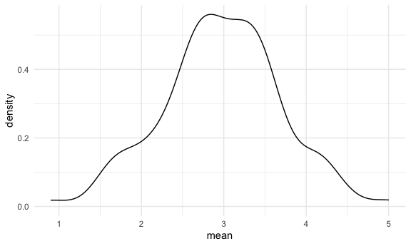
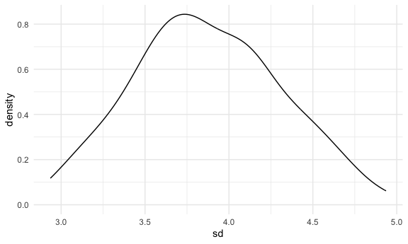

Simulations
================
Pengchen(Ada) Wang
2026-03-28

## Let’s simulate something

``` r
sim_mean_sd = function(sample_size, mu = 3, sigma = 4) {
  sim_data =
  tibble(
    x = rnorm(n = sample_size, mean = mu, sd = sigma)
  )

sim_data %>% 
  summarize(
    mean = mean(x),
    sd = sd(x)
  )
}
```

I can “simulate” by running this line.

``` r
sim_mean_sd(30)
```

    ## # A tibble: 1 × 2
    ##    mean    sd
    ##   <dbl> <dbl>
    ## 1  3.68  3.52

## Let’s simulate a lot

Let’s start with a for loop.

``` r
output = vector("list", length = 100)

for (i in 1:100) {
  
  output[[i]] = sim_mean_sd(sample_size = 30)
  
}

bind_rows(output)
```

    ## # A tibble: 100 × 2
    ##     mean    sd
    ##    <dbl> <dbl>
    ##  1  2.93  2.99
    ##  2  2.76  4.30
    ##  3  2.00  3.54
    ##  4  3.81  3.32
    ##  5  3.56  4.45
    ##  6  3.77  3.98
    ##  7  3.37  5.18
    ##  8  2.31  4.22
    ##  9  3.44  3.79
    ## 10  2.33  4.13
    ## # ℹ 90 more rows

Let’s use a loop function.

``` r
sim_results =
  rerun(100, sim_mean_sd(sample_size = 30)) %>% 
  bind_rows()
```

Let’s look at results …

``` r
sim_results %>% 
  ggplot(aes(x = mean)) + geom_density()
```



``` r
sim_results %>% 
  summarize(
    avg_samp_mean = mean(mean),
    sd_samp_mean = sd(mean)
  )
```

    ## # A tibble: 1 × 2
    ##   avg_samp_mean sd_samp_mean
    ##           <dbl>        <dbl>
    ## 1          2.97        0.717

``` r
sim_results %>% 
  ggplot(aes(x = sd)) + geom_density()
```


